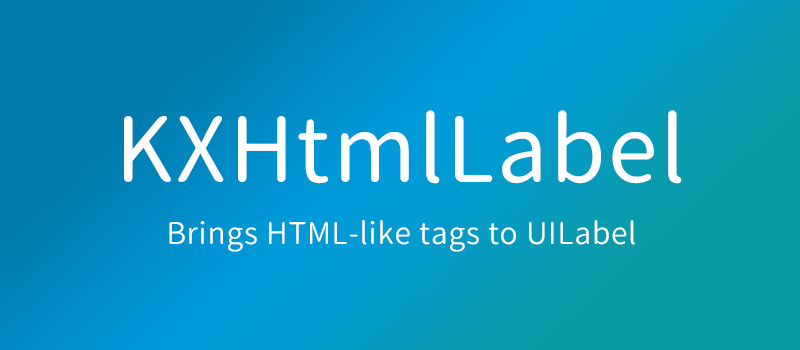
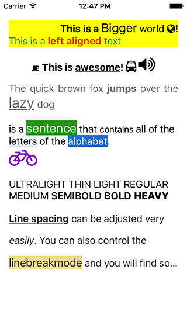

KXHtmlLabel
===

[](http://cocoadocs.org/docsets/KXHtmlLabel)
[](http://cocoadocs.org/docsets/KXHtmlLabel)
[](http://opensource.org/licenses/MIT)

KXHtmlLabel is a powerful **UILabel/UIButton** extension. It enables UILabel/UIButton to interprete **HTML tags**. Besides, it also enables UILabel/UIButton to display awesome icons from **FontAwesome**.

# Features
- Enables **UILabel** and **UIButton** to interprete HTML tags
- Supports **UILabel** and **UIButton** and their subclasses.
- Supports **FontAwesome** html tags
- Supports paragraphs with text aligment and line spacing
- Supports font weight attribute on iOS 8.2 and above


# Requirements

Requires iOS 8.0+ and ARC.

# Installation

### CocoaPods
The easiest way of installing KXHtmlLabel is via [CocoaPods](http://cocoapods.org/). 

```
pod 'KXHtmlLabel'
```

### Old-fashioned way

- Add all subfolders and `*.h, *.m, FontAwesome.otf` from folder `KXHtmlLabel/` to your project.
- Add `CoreText.framework` to your linked frameworks.
- `#import "KXHtmlLabel.h"` where you want to use the framework.

# Usage

## Include the header

```objective-c
#import "KXHtmlLabel.h"
```

## Hello World example

Use `-(void) setHtml:(NSString *)` method to display HTML strings on UILabel

Use `-(void) setHtmlTitle:(NSString *) forState:(UIControlState)` for UIButton

```objective-c
// Display HTML on UILabel
[label1 setHtml:@"<p align=\"right\">Hello <b>World</b>! This is <u>awesome</u>!</p>"];
// Display HTML on UIButton
[button1 setHtmlTitle:@"<b>Hello</b> <font color=\"#00ff00\">World</font>" forState:UIControlStateNormal];
```

## Additional settings

KXHtmlLabel uses its own XML parser to parse HTML strings. To avoid parsing identical strings repeatedly (for instance, display HTML strings in a **UITableViewCell**), KXHtmlLabel caches the parsed results of HTML strings. This feature is turned on by default. 

You can turn off this feature using the following code.

```objective-c
[KXXmlCacheManager sharedManager].enabled = NO; 
```
Also, you can clear the cache by using the following code.

```objective-c
[KXXmlCacheManager sharedManager] clear]; 
```

# Supported tags

KXHtmlLabel only supports the following HTML tags.

| Tag | Supported Attributes | Description |
|:-------------:|:-------------:|:-------------|
| br | N/A | Add newline |
| u | N/A | display text with underscores. |
| s | N/A | display text with strikethrough. |
| b | N/A | Display text in **bold** style. |
| i | class, color, bgcolor | If no classes are defined, text will be displayed in *italic* style. <br/> If class is defined and equals to one of the identifiers in FontAwesome, the corresponding icon will be displayed. Also, the color of the icon can set using color and bgcolor attributes. |
| font | face, size, weight,<br/> color, bgcolor | **face**: font family name <br/>**size**: font size (in points).<br/>**weight**: font thickness, which can be one of the following values: `ultralight, thin, regular, medium`<br/>`, semibold, bold, heavy, black`. <br/> Note that the font weight attribute is only supported on iOS 8.2 and above. On previous versions of iOS this attribute is ignored by default. <br/> **color**: text color. <br/> **bgcolor**: text background color. |
|p| align, linespacing, linebreakmode | **align**: text alignment, which can be one of the following values: `left, center, right, justify`.<br/> **linespacing**: the vertical space between lines. <br/> **linebreakmode**: style of word wrapping, which can be one of the following values: `wordwrap, charwrap, clipping,`<br/> `truncatehead, truncatetail, truncatemiddle`|

# More examples


```objective-c

//Display text in bold style.
label.setHtml("<b>Bold</b>");

//Display text in italic style.
label.setHtml("<i>Italic</i>");

//Display a [fa-bus] icon from FontAwesome
label.setHtml("<i class=\"fa-bus\"></i>");

//Display a text with foreground color `#ffffff` and background color `#00ff00`
label.setHtml("`<font color=\"#ffffff\" bgcolor=\"#00ff00\">Hello</font>");

//Display a text with center alignment and set linespacing to 15
label.setHtml("<p align=\"left\" linespacing=\"15\">Hello World. This is a paragraph....</p>");

```

# Screenshots



# License

KXHtmlLabel is licensed under the terms of the MIT License. Please see the [LICENSE](LICENSE.md) file for full details.
If there is any suggestion, I would love to hear from you.

This project uses FontAwesome fonts by Dave Gandy - [fontawesome.io](http://fontawesome.io)